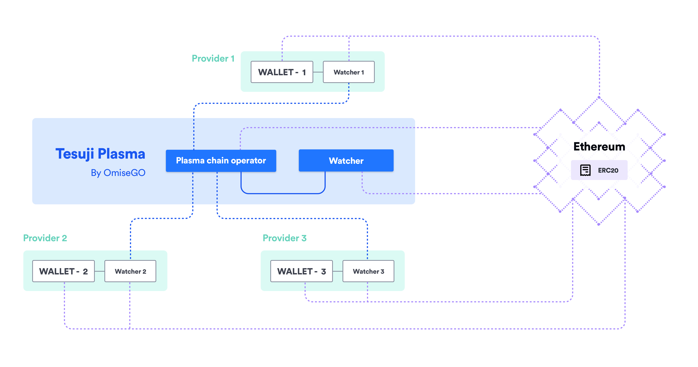

# elixir-omg
The `elixir-omg` repository contains OmiseGO's Elixir implementation of Plasma and forms the basis for the OMG Network.

The first release of the OMG Network is based upon **Tesuji Plasma**, an iterative design step over [Plasma MVP](../plasma-mvp). The diagram below illustrates the relationship between the wallet provider and how wallet providers connect to **Tesuji Plasma**.



See the [Tesuji Plasma design document](FIXME) for a full description for the Child Chain Server and Watcher.

A description of the [application architecture](docs/architecture.md) may be found in the `docs` directory.

For specific documentation about the child chain server, see [apps/omg_api](apps/omg_api).

For specifics on the watcher, see [apps/omg_watcher](apps/omg_watcher).

For generic information, keep on reading.

## Getting Started
**IMPORTANT NOTICE: Heavily WIP, expect anything**

A public testnet for the OMG Network is not yet available. However, if you are brave and want to test being a Tesuji Plasma chain operator, read on!

### Install
Firstly, **[install](docs/install.md)** the child chain server and watcher.

### Setting up
The setup process for the Child chain server and for the Watcher is quite similar:

1. Provide an Ethereum node running connected to the appropriate network, `Byzantium` is required to be in effect
1. Initialize the child chain server's `OmiseGO.DB` database.
Do that with `mix run --no-start -e 'OmiseGO.DB.init()'`
1. (**Child chain server only**) Deploy `RootChain.sol` contract and prepare operator's authority address
1. Produce a configuration file with `omisego_eth` configured to the contract address, operator (authority) address and hash of contract-deploying transaction.
To do that use the template, filling it with details on the contract:

        use Mix.Config

        config :omisego_eth,
          contract_addr: "0x0",
          authority_addr: "0x0",
          txhash_contract: "0x0"

### Troubleshooting
Solutions to common problems may be found in the [troubleshooting](docs/troubleshooting.md) document.

### Testing & development

- Quick test (no integration tests):
```
mix test
```
- Longer-running integration tests: ```mix test --only integration``` (requires compiling contracts)

For other kinds of checks, refer to the CI/CD pipeline (`Jenkinsfile`).

- To run a development `iex` REPL with all code loaded:
```
iex -S mix run --no-start
```
