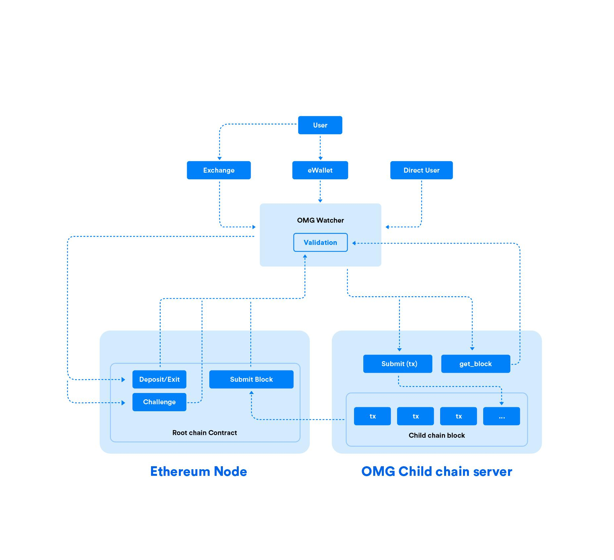

# Architecture

This is a high-level rundown of the architecture of the `elixir-omg` apps.

The below diagram demonstrates the various pieces and where this umbrella app fits in.

**NOTE** only use the high-level diagram to get a vague idea, meaning of boxes/arrows may be imprecise.

## Interactions

**[Diagram](https://docs.google.com/drawings/d/11ugr_VQzqh0afU6NPpHW893jww182POaGE3sYhgm9Gw/edit?usp=sharing)** illustrates the interactions described below.

This lists only interactions between the different processes that build up both the Child Chain Server and Watcher.
For responsibilities of the processes/modules look into respective docs in `.ex` files.

**NOTE**:
- for `OMG.API` modules/processes look in `apps/omg_api`
- for `OMG.Watcher` modules/processes look in `apps/omg_watcher`
- for `OMG.Eth` look in `apps/omg_eth`
- for `OMG.DB` look in `apps/omg_db`
- for `OMG.Performance` look in `apps/omg_performance`
- for `OMG.JSONRPC` look in `apps/omg_jsonrpc`

**NOTE 2** The hexagonal shape hints towards component being a wrapper (port/adapter) to something external, versus rectangular shape being an internal component.

### `OMG.API.State`

- writes blocks and UTXO set to `OMG.DB`
- pushes freshly formed blocks to `OMG.API.FreshBlocks`

### `OMG.API`

- accepts child chain transactions, decodes, stateless-validates and executes on `OMG.API.State`
- forwards `get_block` requests to `OMG.API.FreshBlocks`

### `OMG.API.FreshBlocks`

- reverts to reading `OMG.DB` for old blocks

### `OMG.API.RootchainCoordinator`

- reads Ethereum block height from `OMG.Eth`
- synchronizes view of Ethereum block height of all enrolled processes (see other processes descriptions)

### `:exiter`

Actually `OMG.API.EthereumEventListener` setup with `:exiter`.

- pushes exits to `OMG.API.State` on child chain server's side
- tracks exits via `OMG.API.RootchainCoordinator`

### `:depositor`

Actually `OMG.API.EthereumEventListener` setup with `:depositor`.

- pushes deposits to `OMG.API.State`
- tracks deposits via `OMG.API.RootchainCoordinator`

### `OMG.API.BlockQueue`

- requests `form_block` on `OMG.API.State` and takes block hashes in return
- tracks Ethereum height and child chain block submission mining via `OMG.Eth` and `OMG.API.RootchainCoordinator`

### `OMG.API.FeeChecker`
- `OMG.API` calls it to get acceptable currencies and actual fee amounts to validate transactions

### `OMG.Watcher.BlockGetter`

- tracks child chain blocks via `OMG.API.RootchainCoordinator`
- manages concurrent `Task`'s to pull blocks from child chain server API (JSON-RPC)
- pushes decoded and statelessly valid blocks to `OMG.API.State`
- pushes statefully valid blocks and transactions (acknowledged by `OMG.API.State` above) to `WatcherDB`
- emits block, transaction, consensus events to `OMG.Watcher.Eventer`

### `OMG.Watcher.ExitValidator` (fast)

TODO - possible requires sorting out of this vs `:exiter`

### `OMG.Watcher.ExitValidator` (slow)

TODO

### `Phoenix app` (not a module - section name TODO)

- uses data stored in the `WatcherDB` to server user's requests
- subscribes to event buses to `OMG.Watcher.Eventer`

### `OMG.Watcher.Eventer`

- pushes events to `Phoenix app`

### `OMG.JSONRPC`

- exposes `OMG.API` via a `cowboy`-driven JSON-RPC2 interface

### `OMG.Performance`

- executes requests to `OMG.JSONRPC`
- forces block forming by talking directly to `OMG.API.State`

## Databases

The confusing (and to be probably amended in the future) part is that we have two databases

### `OMG.DB`

An "intimate" database for `OMG.API.State` that holds the UTXO set and blocks.
May be seen and read by other processes to sync on the persisted state of `OMG.API.State` and UTXO set by consequence.

Non-relational data, so we're having a simple KV for this.

Implemented with `leveldb` via `ExlevelDB`, possibly to be swapped out for anything better in the future.
Each instance of either Child Chain Server or Watcher should have it's own instance.

Database necessary to properly ensure validity and availability of blocks and transactions

- it is read by `OMG.API.State` to discover the UTXO set on restart
- it is read by many other processes to discover where they left off, on restart

### `WatcherDB` (TODO - name? there is no such module as `WatcherDB`)

A convenience database running alongside the Watcher **only**.
Holds all information necessary to manage the funds held:
- UTXOs owned by user's particular address(es)
- all transactions to be able to challenge
- transaction history

Relational data, to be able to navigate through the transactions and UTXOs.

Implemented with Postgres (SQLite for test runs).
This database might be shared between Watchers, e.g. when it pertains to a single wallet provider running multiple `eWallet` instances for scaling.
