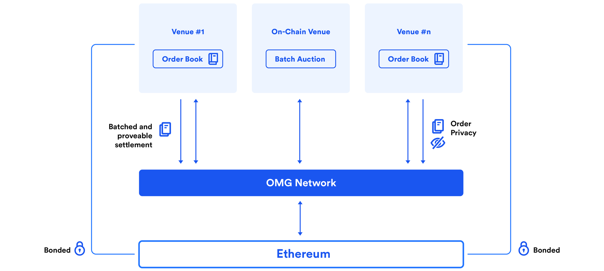
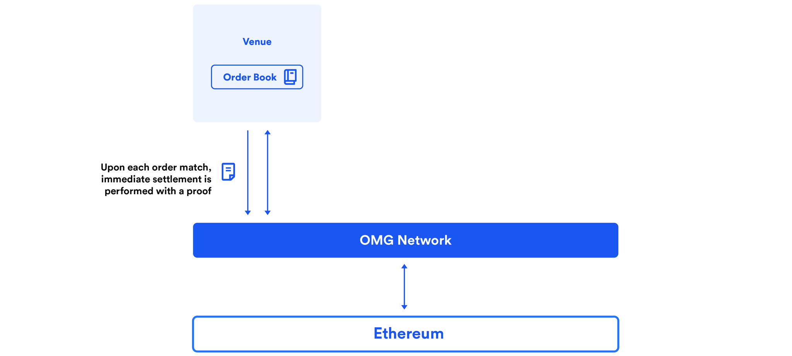
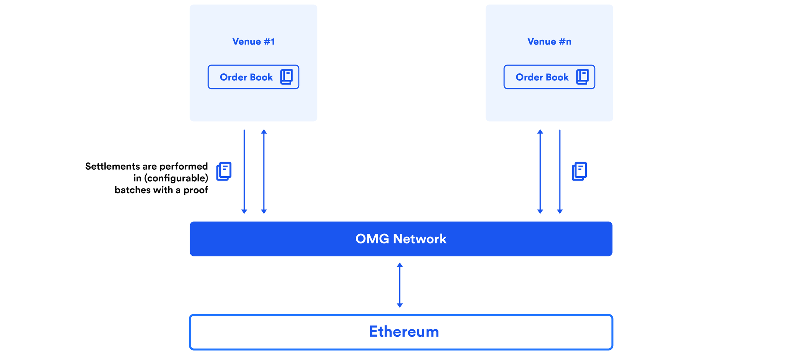
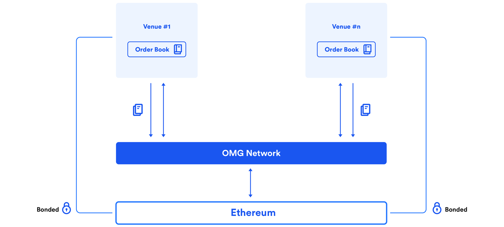
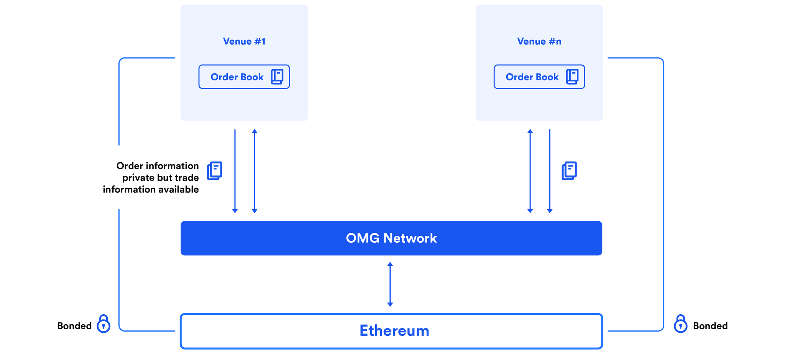
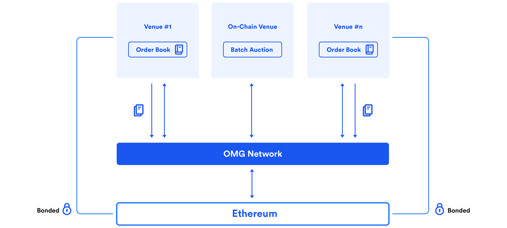
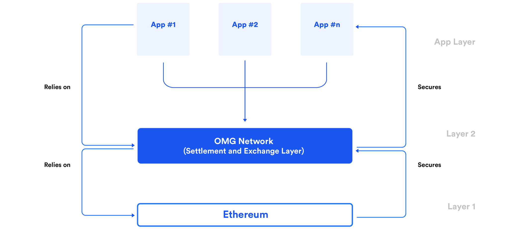
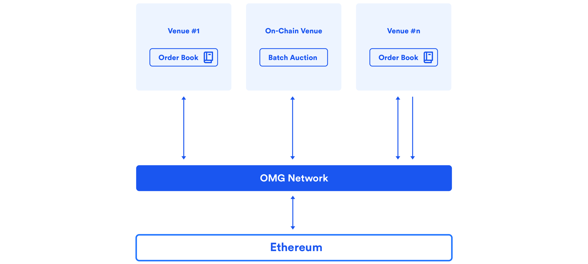

# The OMG decentralized Exchange (ODEX)

The term decentralized is a very broad term and typically is a catch-all for a number of characteristics or dimensions. For example, we may use the term decentralized to refer to the lack of a single controlling entity, and as a result bring the benefit of censorship resistance.

Similarly the term “DEX” (decentralized exchange) also sees broad use with no widespread accepted definition. In order to provide clarity and consistency of understanding when talking about decentralization, or more specifically a DEX, we've decided to decompose our use of the term into a non exhaustive list of dimensions. We can then use these dimensions to describe the OMG DEX itself, its benefits and detail how we will prioritize its development. For the remainder of this document we will refer to the OMG DEX as "ODEX" for brevity.

## A Taxonomy for Decentralization

To help establish a reusable taxonomy of decentralization using our identified dimensions we have grouped the them into three categories. Each category represents some aspect, or potential benefit, that may arise as a result of decentralization. These categories are:

* **Intrinsic Dimensions** — these dimensions arise directly as a result of decentralization.
* **Value Dimensions** — these dimensions are values we wish to support by leveraging the intrinsic and structural properties decentralization can bring. Specifically these are value dimensions that facilitate the delivery of fair and transparent markets.
* **Structural Dimensions** — structural dimensions are properties that arise from the specific choices made when designing our decentralized exchange.

## Intrinsic Dimensions of Decentralization

|Dimension|Benefit to the End User|
| - | - |
|Secure / Trustless|User funds are safe from being hacked as users retain custodial control of their funds|
|Uncensorable|No single venue can stop you from being a participant|

## Value Dimensions Enabled by Decentralization
|Dimension|Benefit to the End User|
| - | - |
|Private|Post-trade Anonymity — no adverse market reaction, by the time the market sees a trade the market reaction has already been considered in the visible market|
|Private|Pre-trade Anonymity — no adverse market selection|
|Transparent|Pre-trade Transparency — The ability to offer an accurate view of market liquidity|
|Fair|Quality liquidity — the ability to access provable transparency information resulting in increased trust in the market brings better price discovery and a fairer market overall|
|Liquid|Reduced fragmentation of liquidity by providing a single network on which all order flow can be connected|
|Cost control|Visibility of cost structure|

## Structural Dimensions Resulting from OMG Network Implementation
|Dimension|Benefit to the End User|
| - | - |
|Transparent|Post-trade Transparency — The ability to offer a provably accurate view of post-trade prices|
|Fast settlement|Trades settle quickly and you choose when your trades settle|
|Mobility of funds|Easily move your funds between different venues on the OMG Network to achieve 'best execution'|
|Interoperable|Trade with other blockchains that are compatible with the OMG Network: Bitcoin, Litecoin, etc|
|Upgradeable|Transparency in the upgrade process|
|Responsive|Trade when you want to trade (reduced probability of network congestion due to the higher throughput of the OMG Network)|
|Private|Identifying yourself may not be required in all exchanges|

It isn’t possible to solve for *all* of the dimensions listed above, and each of the dimensions must be treated as design decisions on a spectrum, however using the taxonomy allows us to make informed choices around the impacts of our design choices and aids prioritization. In the following sections we will offer overviews of a number of alternative, evolving models, each driven by various tradeoffs for the dimensions above.

In each of the models our primary goal is to solve for security and specifically the minimisation of funds loss. Thereafter, there exists a number of options in the design space balancing other key dimensions such as fairness, price transparency, user privacy, and speed.

# ODEX Features

## Introduction

This section will review the key features of ODEX. The following diagram is a high level view of what we think the future state of the ODEX may look like. This diagram will be described in detail throughout the remaining sections. A key observation should be that the ODEX is more than just a single market. It is an infrastructure upon which any participant can engage in using, making or delivering a market. This means many market models can be supported, all with the same underlying benefits and guarantees of the ODEX, while simultaneously offering tailored trading experiences as appropriate to the target users. This means that ODEX is more than just a single market, it is a network supporting many markets with both direct users of the ODEX co-existing beside indirect users of the ODEX such as venues themselves.

## Constrained Custody

OmiseGO proposes a solution whereby user funds are secured by the child chain consensus mechanism. The exchange of value occurs in a secure manner, which vastly reduces the risk exposure for both a venue *and* for the user.

We can provide this custodial safety using a model which utilizes the safety of the child chain consensus mechanism.

Constrained Custody allows custody transfer to an off-chain venue to facilitate matching but only allows the venue to perform the required, fundamental actions, such as partial matching, canceling and initiation of settlement.

The constraints that are placed upon funds in custody of a venue are:
* The venue can neither deposit nor exit from the child chain
* Transactions to move funds must be represented as trade settlements. The venue must prove that the beneficiaries of the settlements wanted to trade (by their signed orders).

In other words, a venue cannot spend or exit user funds.

Therefore, whilst users may transfer custody of their funds to a venue, the users will rely on the safety of the child chain consensus to enforce how a users' funds may be used. Also, importantly, this facilitates, in an efficient and fundamental way, firm orders. Firm orders are an essential component of any fair market.

Note that work on Constrained Custody is continuing and changes can be expected to this design.

## Multiple Venues

As stated in the introduction the ODEX will support multiple venues, removing single points of failure and reducing the possibility that a user will be refused exchange services. Multiple venues increases censorship resistance.

The possible addition of an on-chain exchange in the future would add much greater censorship resistance.

## Off-Chain Markets

Off-chain markets (typically orderbook driven) are important, not only to move computationally intensive tasks away from the operator/validators, but also to give venues the flexibility to change their market microstructure (such as minimum tick size, fee structure and so on) to ensure a competitive and differentiated market for an exchange's services, and markets themselves. It also has material implications on the speed and efficiency of the matching and trading process as we will see later.

## On-Chain Markets (Parallel Phase)

In conjunction with off-chain markets, an on-chain market that is maintained by the child chain consensus system may be added. Further research is underway in this area to identify how an on-chain market, which could be offered using an orderbook structure, fits into the ODEX market model. It is also possible that multiple on-chain markets may be supported to differentiate between the specific needs of particular markets.

The research and the introduction of an on-chain market may occur in parallel to the development of off-chain market support.

Initially, it is thought that an on-chain market would have the following characteristics:

* Call market, rather than continuous market

* Auction based mechanism built on an orderbook

Whilst an on-chain market may not offer the best price to participants (for example, because of lower liquidity concentration or slowness in reacting to fundamental changes in value), the on-chain market can offer guaranteed access to an exchange mechanism for participants that cannot, or choose not to, gain access to other venues on the ODEX.

## Batch Settlement

Without batch settlement, it would be expected for venues to immediately settle any order execution. In a low transaction environment that can work effectively however it doesn't scale particularly well. By supporting batch settlement we can reduce the number of transactions required for settlement, and it is therefore useful for:

* Auctions

* Efficiently settling in highly liquid markets

* Atomic settlement where multiple orders are resolved simultaneously, such as options markets

* Settlement of implied orders. Implied orders are necessary for the OmiseGO core user story. Implied orders enable the exchange of two assets that do not directly trade against one another. For example,

    * A user has Burger tokens and a cafe accepts Coffee tokens

    * There is no market for BURGER/COFFEE tokens

    * However, there is a market for BURGER/ETH and ETH/COFFEE

    * Therefore an implied price and an implied order can be derived

## Proveable Trade Settlement

A venue will not be allowed to ‘spend’ or move funds in an unconstrained manner. Instead funds may only be ‘settled’ and a proof must be produced by the venue with the orders that constitute the resultant settlement.

Proveable trade settlement increases the safety of the exchange for users and provides valuable post-trade transparency (see next section).

## Pre-trade and Post-trade Transparency

Post-trade transparency provides trade information after a trade has been executed. Whereas pre-trade transparency indicates prices at which participants are willing to pay. High quality, and trusted transparency is an essential requirement for fair markets and good price discovery.

Transparency is also important because the data can be used to predict price changes and to validate the proofs generated by venues on the ODEX.

Whilst there may be multiple venues operating independently on the ODEX, information about how the market is operating may be consolidated.

A ‘global’ ticker tape could be derived for:

* Prices for all trade executions for a particular venue, or the network as a whole

* Last price for any instrument (currency pair such as ETH/OMG)

* Trusted pricing metrics and price movements for any instrument could be offered as an extension to basic ticker information

## Order Privacy

In traditional markets, order details are private to a trader. This is a very important as it allows traders to take positions which reflect what they see as the fundamental value of the instrument being traded, without the knowledge that *they* are taking a position or *how* they are taking the position. If the order details were public other traders could use it to infer information about the instrument's value or other traders intent and strategies. For example that a specific trader was hedging one instrument against another. It is also a key aspect of fair markets in general, and so it is highly undesirable for this information to be made public.

# ODEX Phases

## Introduction

In this section we present our current phasing of development for ODEX to illustrate how we can incrementally prove out the features of ODEX that underpin the value proposition captured by the previous dimensions of decentralization. As this phasing is incremental (though not necessarily serial) any functionality added in each phase is *cumulative*, unless otherwise specified.

## Phase 1 - Technology Proof of Concept

Phase 1 implements all the technical components and the basic child chain consensus changes that are required to prove out the feasibility of the ODEX.

Orders are matched off-chain and trades are immediately settled on-chain with a proof.

## Phase 2 - MVP

Batch settlements are introduced in Phase 2. Batch settlements most importantly will enable implied orders, which are required to fulfill one of the primary OmiseGO use cases (see Appendix).

Batch settlement optimizes the settlement process because settlement is the net outcome of all of the trades in a batch. Matching must be performed in a deterministic way such that proofs may be independently verified.

Phase 1 and phase 2 have an interesting safety property. Since the private key for a venue is only used to sign proofs for settlements, loss of the private key will not result in user funds being lost. However, if an attacker was able to gain access to a venue's private key, the attacker may be able to spam the network.

Caution: Care must be taken to ensure that computation complexity of validating all of the settlement proofs can be accommodated by both a single operator (in PoA) and by the target validator sizing (in PoS).

## Phase 3 - Bonded Exchanges

Phase 3 introduces an explicit economic disincentive for a venue to perform bad behavior. Upon proof of bad behaviour, such as an invalid settlement, a venue would lose some or all of their bond.

The size of the bond that needs to be posted is yet to be decided. However, it may be possible for the bond to be sized proportionally to the amount of risk on the order books of an exchange. Without a considered approach to bond sizing venues would be disincentivized from providing matching facilities and therefore users would ultimately suffer as the cost of transacting would become very high. This would incentivize users to seek alternative, less secure and more centralized venue offerings.

## Phase 4 - Order Privacy

Phase 4 introduces order privacy, most likely utilizing zero knowledge proofs. Note that this phase is a research topic and is subject to change.

Zero knowledge proofs protect traders from revealing order details, but maintains provable trade settlement and post-trade transparency. In other words the basic economic details of a trade is known (the price and quantity), but not the specific details of the orders that were executed to complete that trade. This details could include information such as who traded, any limit price, original quantity and so on. Were this information available it would be very difficult for any trader to achieve a fair price with risk of adverse selection and therefore transitory volatility would increase in the market, damaging price discovery and increasing the cost of trading overall.

Some flexibility may be possible with order privacy, whereby some order details are public and some order details are not public. This may be on a per venue or a per order basis. This is an active area of our research, both from a technical and markets perspective.

## OMG On-Chain Markets

In conjunction with off-chain markets, on-chain markets that are maintained by the child chain consensus system is planned. Further research will be performed in this area to identify how on-chain markets fit into the ODEX market model.

The research may occur in parallel to the development of off-chain markets, but development will initially commence with Constrained Custody (phase 1 and 2).

As was stated previously it is thought that viable and useful on-chain markets would be:

* Periodic Call markets, rather than Continuous markets, and be,

* Auction based, executed using an orderbook

On-chain markets have the attraction of providing guaranteed access (censorship resistance) to matching services for any participant. However, on-chain markets in and of themselves my not offer the best available execution because of a slower speed of market adaption (slower movement towards the fundamental value of an instrument), lower access to counterparty interest at the desired price (lower concentration for liquidity of an instrument) and potential a higher cost of trading (it may not be feasible to reduce the cost of trading in on-chain markets as batching may not be as efficient).

Having said that, on-chain markets can provide several key features beyond simply universal access. On-chain markets can provide uniform access to all participants on ODEX, venues and users alike and therefore on-chain markets can provide a conduit for liquidity access between all participants and a baseline view of pricing for any trading instrument.

## Comparison of Phases

||Phase 1|Phase 2|Phase 3|Phase 4|On-Chain|
|--- |--- |--- |--- |--- |--- |
|Settlement|Per-Order|Batch|Batch|Batch|Batch + Auction|
|Partial fills|Y|Y|Y|Y|Y|
|Implied orders, auctions|N|Y|Y|Y|Y|
|Direct disincentive against incorrect venue behaviour?|N|N|Y|Y|Y|
|Orders private?|N|N|N|Y|Y|
|On-chain order book|N|N|N|N|Y|

# Functional Market Structure

## Introduction

For the ODEX to be successful, the DEX must address the basic market model principles of a well-functioning market. A well functioning market has many characteristics and the features of ODEX previously discussed has already called out many of these. The purpose of this section is to call out, in a practical sense, the requirements that need to be met to support the OmiseGO vision.

## Market Microstructure

In order to appreciate the detail in this section we need to introduce how we define the concept of market duration.

Any market can exist for an arbitrary period of time, and in fact while someone, somewhere is making a market in a particular instrument we can say there exists a market for that instrument. In practical terms however we must assume that for any venue there will be a period over which they explicitly make a market for an instrument. In a traditional venue these market durations are usually determined by wider practical limitations.

For example most market durations are a single day, with the market being reset each day, or perhaps over a week with the market being reset, or paused weekly. These limitations can be things like people sleep at night and therefore in a localized market there will only be thin trading overnight so the markets simply close. It could be aligned to a feature of the instrument and so on.

In the crypto markets we tend to have global 24/7 markets and so concepts like a trading "day" are less valuable. However these concepts are still critical in operating an effective and orderly market as they facilitate things like the ability to determine orders are stale, or provide an opportunity to perform market resets, or venue maintenance.

### Market Duration

To help us identify and understand the market structures that the ODEX must support we have adopted a taxonomy, really a vocabulary, for describing market duration so as to allow us to anchor the requirements we will place on ODEX to support any overlaid market model. This vocabulary is as follows:

* Any market can be divided into Trading Cycles (a cycle could for example last a day)

* A Trading Cycle may have one or more Trading Phases (within a cycle you might have a pre-open, open, after-hours and close phase)

* Each Trading Phases may be decomposed into Trading Sessions (a session might be an auction session, or a continuous trading session)

With this macro view of market duration, as delivered by any one specific venue on the ODEX, we can now be more specific about duration requirements as they relate to the ODEX itself. Any venue connected to the ODEX can of course adopt any duration model they like but the vocabulary identified will allow those models to be mapped as needed to the features that ODEX offers.

### Required Order Types

This section details the minimal characteristics of orders that must be supported. Typically these characteristics are captured as "order types" in a venue. Most other order types can be composed from these fundamental features.

**Fill Constraints**

* Partial fills of orders must be supported

**Continuous Market - Immediacy**

* Market order (only a quantity is specified)

* Limit order (quantity, price)

* Quote limit order (two-sided limit order that is required for market-makers)

**Continuous Market - Time in Force**

* Good for cycle (order is good until the end of the current cycle)

* Immediate or cancel (order must fill immediately, otherwise the order is cancelled)

**Auctions**

* Market order (quantity only)

* Limit order (quantity, price)

**Implied orders**

* Exchange of two assets that do not have directly trade against one another

## Minimal Required Participants

In order for ODEX to be minimally viable we will need to have at least the following participants:

* At least one exchange (aka venue)

* Users

* Market maker

* Child Chain Operator (at PoA), Validators (at PoS)

# Safety Considerations

The following diagram illustrates the security at differing layers for the OMG Network.

The OMG Network relies on the safety of Ethereum, and applications that run on the OMG Network will rely on the consensus mechanism of the OMG Network.

Further research will be performed to consider the safety of the OMG Network and the core goal for what the OMG Network should be providing safety for.

The prior descriptions about the ODEX assume that the safety of venues are tightly coupled in the consensus of the OMG Network. That is, venues are considered as part of layer 2.

It may not be desirable to couple the consensus of the OMG Network into venues because of the potentially unbounded amount of computation that would be required for validators. In that event, venues could be moved to the ‘App’ layer, and define their own safety and security guarantees.

An alternative final state of the ODEX would then look as follows:

Whilst this model may relieve validators of computational load, we should take note the following points:

1. The value proposition to venues to integrate into the ODEX is greatly reduced because the operational risk for the funds in a venue is borne by the venue.

2. It is generally understood that a continuous market, not a call market (which a batch auction is) has greater liquidity. This is due to the limited pre-trade transparency and lack of immediacy of call markets.

Further research may uncover mechanisms to support more functional on-chain markets and how those markets would fit into the overall ODEX market model.

# Value Proposition

## Introduction

This section describes the proposed value proposition of the ODEX to each of the different users and stakeholders in the OMG ecosystem.

These value propositions still need to be validated for each of the target users and stakeholders.

## End Users of Venues

* A list of benefits can be found at the start of this document.

## Existing Crypto and Traditional Venues

Existing crypto exchanges can be hacked, leading to loss of user funds, loss of capital and loss of user confidence in the crypto ecosystem. Traditional venues (typically regulated) would like to participate in the crypto markets and offer services to their users but face all the same issues as crypto venues and therefore expose themselves to significant reputational damage and fail to offer a secure enough market to be attractive to their existing members. Both venue types could benefit significantly from:

* Constrained Limited Custody of user funds

* Reduced regulatory exposure (such as not taking user deposits)

* Simplified operations due to lack of requiring a hot/cold wallet system

* Existing business models are generally compatible with the ODEX

## eWallet and Wallet Users

eWallet and Wallet users suffer from security risk and immediacy of fund transfers. The ODEX will offer the following key benefits:

* Access to exchange functions that can support cross-currency payments

* Faster access to liquid markets to trade in

* The same benefits as end users of venues

## OMG Network

The OMG network provides value by incentivizing a growing network of participants all of whom can benefit from the existence of the network. ODEX can help support network growth and evolution from:

* Fees derived from transaction volume that is generated from settlements

# Appendix

## Supporting User Story

During all discussions surrounding the ODEX design, it important to remember that the DEX must support the following fundamental user story:

>As Alice I can cheaply use Burger tokens to Bob to make a payment to Bob (who accepts Coffee tokens)

Similarly, the DEX should support the above user story when "Burger tokens" and Coffee tokens” are substituted for any type of asset that may be traded on the OMG Network. This may include fiat or asset backed tokens, stablecoins and cryptocurrencies.

## Prior DEX Designs

We investigated multiple types of designs, of which many have acted as inputs to the designs outlined within this document.

A matrix comparing each of the current and prior designs against the dimensions that were described earlier in this document can be found below.

[https://docs.google.com/spreadsheets/d/1-i304AhhiddXOezouQVCJZzyCa2RlQ-TfrKiBjyoLZY/edit?usp=sharing](https://docs.google.com/spreadsheets/d/1-i304AhhiddXOezouQVCJZzyCa2RlQ-TfrKiBjyoLZY/edit?usp=sharing)
